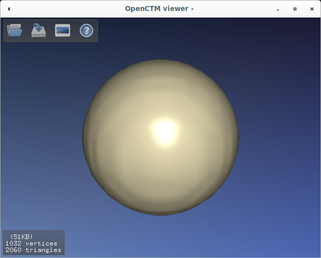

# PyTessel

## Purpose

Python package for building isosurfaces from 3D scalar fields

## Usage

```python
from pytessel import PyTessel
import numpy as np

def main():
    pytessel = PyTessel()

    # generate some data
    x = np.linspace(0, 10, 50)
    y = np.linspace(0, 10, 50)
    z = np.linspace(0, 10, 50)
    grid = np.vstack(np.meshgrid(x, y, z)).reshape(3,-1).T

    R = [5,5,5]
    scalarfield = np.array([gaussian(r,R) for r in grid]).reshape([len(x),len(y),len(z)])
    unitcell = np.diag(np.ones(3) * 10.0)

    vertices, normals, indices = pytessel.marching_cubes(scalarfield.flatten(), scalarfield.shape, unitcell.flatten(), 0.1)

    pytessel.write_ply('test.ply', vertices, normals, indices)

def gaussian(r, R):
    return np.exp(-(r-R).dot((r-R)))

if __name__ == '__main__':
    main()
```

The isosurface is written to `test.ply` and can, for example, be opened using `ctmviewer`.


